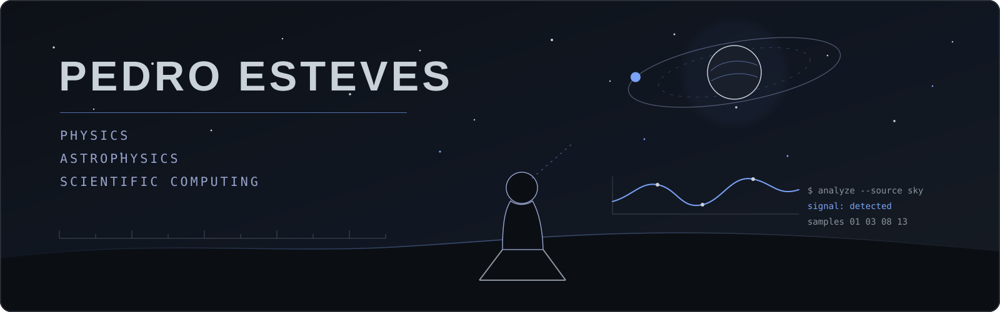
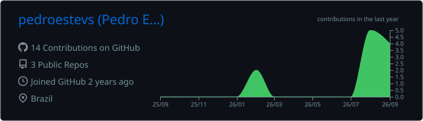
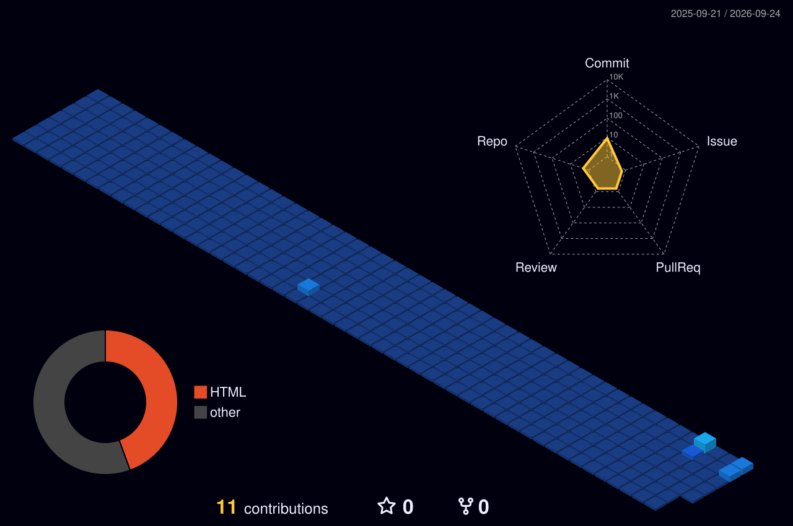

  

# Pedro Esteves

Physics undergraduate at the Federal University of Santa Catarina (UFSC) 
Astrophysics, astronomical data and scientific computing

## About

I'm an undergraduate Physics student at the Federal University of Santa Catarina, working with observational astronomy and scientific data analysis.

My main interests are stellar astrophysics and exoplanets, particularly the use of photometric, astrometric and time-series data to investigate stellar systems and other astrophysical phenomena.

Programming is part of my research workflow, from processing astronomical catalogues to developing reproducible data-analysis pipelines and software tools.

## Research

<table>
  <tr>
    <td width="50%" valign="top">
      <strong>Astrophysics</strong>  
      Stellar astrophysics 
      Exoplanets 
      Stellar variability 
      Binary and multiple systems 
      Circumstellar environments
    </td>
    <td width="50%" valign="top">
      <strong>Data and computation</strong>  
      Astronomical surveys 
      Photometric analysis 
      Time-series analysis 
      Scientific computing 
      Catalogue processing 
      Data visualization
    </td>
  </tr>
</table>

## Scientific data

`Gaia` &nbsp; `VVV / VVVX` &nbsp; `VIRAC2` &nbsp; `TESS` &nbsp; `Spitzer / GLIMPSE` &nbsp; `DECaPS`

## Skills and stack

<table>
  <tr>
    <td width="50%" valign="top">
      <strong>Scientific computing</strong>  
      <code>Python</code> <code>NumPy</code> <code>Pandas</code> 
      <code>SciPy</code> <code>Astropy</code> <code>Matplotlib</code>
    </td>
    <td width="50%" valign="top">
      <strong>Software development</strong>  
      <code>FastAPI</code> <code>Next.js</code> <code>React</code> 
      <code>Node.js</code> <code>npm</code> <code>REST APIs</code> 
      Backend and frontend development
    </td>
  </tr>
  <tr>
    <td width="50%" valign="top">
      <strong>Data</strong>  
      <code>SQL</code> <code>PostgreSQL</code> 
      Relational databases
    </td>
    <td width="50%" valign="top">
      <strong>Infrastructure and workflow</strong>  
      <code>Docker</code> <code>Docker Compose</code> 
      <code>Git</code> <code>GitHub</code> <code>Linux</code> <code>WSL</code>
    </td>
  </tr>
  <tr>
    <td colspan="2" valign="top">
      <strong>Authentication and integrations</strong>  
      <code>OAuth 2.0</code> <code>JWT</code> <code>API integrations</code>
    </td>
  </tr>
</table>

## GitHub activity

  

## Contributions

  

## Selected work

My repositories include work in astronomy, scientific computing, data analysis and software development.

<!-- Add selected repository cards or a concise project list here. -->

## Contact

[LinkedIn](https://www.linkedin.com/in/pedro-esteves-14539b234/L) &nbsp; [Email](mailto:estevesp8@gmail.com)
